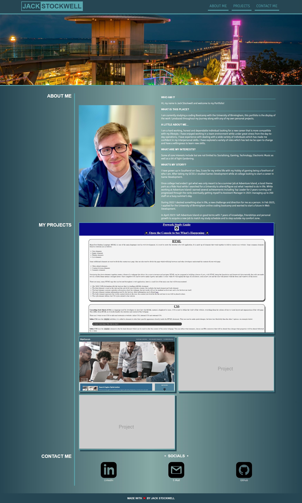

# Jack Stockwell's Portfolio

## Desciption

I wanted to create something that I could use the knowledge I have gained and put it to the test, thus I create this` personal Portfolio belonging to myself, Jack Stockwell created entirely from the ground up to showcase not only my work/future work but my own website building capability. This portfolio will serve as a basis in which all of my future projects can be viewed and accessed from allowing for potential partners or future employers to observe.

I learned a valuable amount of experience, in particular with CSS and the approach to responsive website design. My understanding has deepend greatly through trial and error and using the variuous free online tools available to me.

## Installation

N/A

## Usage

Website can be viewed [Here](https://jackstockwell.github.io/portfolio/)

## Screenshots

## Credits

[W3Schools CSS](https://www.w3schools.com/css/default.asp) - Used to read up on a large array of CSS syntax.

[W3Schools HTML](https://www.w3schools.com/html/default.asp) - Used to read upon on a large array of HTML syntax.

[A complete guide to Flexbox](https://css-tricks.com/snippets/css/a-guide-to-flexbox/) - For the use and understand of FlexBox.

[Hover Nav Guide](https://css-tricks.com/css-link-hover-effects/) - Used to create the animations along the nav bar.

[Help with Pseudo Classes](https://stackoverflow.com/questions/13233991/combine-after-with-hover) - Helped with selecting and determining the Pseudo Classes.

[Learn CSS Grid](https://www.youtube.com/watch?v=rg7Fvvl3taU&t=1313s) - A Basic introduction tutorial video on Grid, was used to creat the projects flow.

